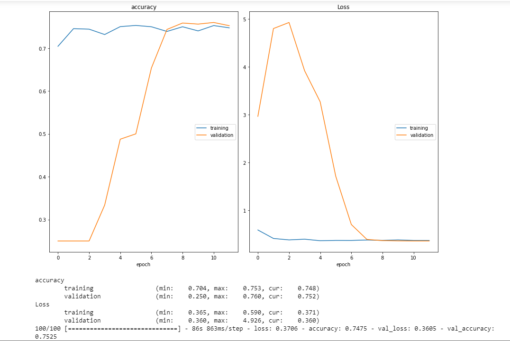

# Classifying Signals from Outer space
DataSet: Firstly the dataset was in the form of Time Series Data , and then the data was converted into 2D Spectrogram images of outer space radio signals collected by the Allen Telescope Array at the SETI Institute. So that CNN Model can be Applied on spectrogram images.
The Project has been inspired by the SETI Institute Code Challenge held in 2017.
There are 4 classes to classify: "squiggle", "narrowband", "noise", "narrowbanddrd".
# Steps in the Classification Process are:
1) Import the Libraries.
2) Load and Preprocess the data.
3) Plot 2D Spectrograms.
4) Create Training and Validation Data Generators.
5) Building the CNN model.
6) Learning Rate Scheduling and compile the model.
7) Train the Model.
8) Model Evalutation.

# Screenshots:
# 1) 2D Spectrograms

# 2) Loss Function and Accuracy

# 3)Confusion Matrix

The Accuracy of the Model was: 75.50 %
The model could be optimized using Transfer Learning and using VGG network and by doing hyperparamter tuning.

